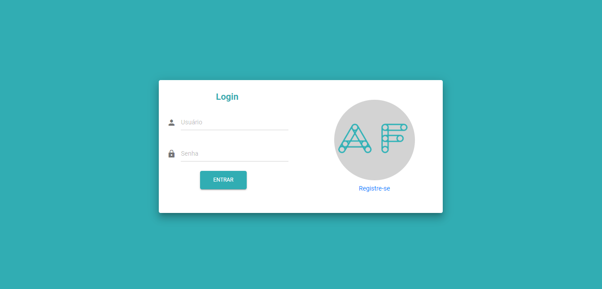
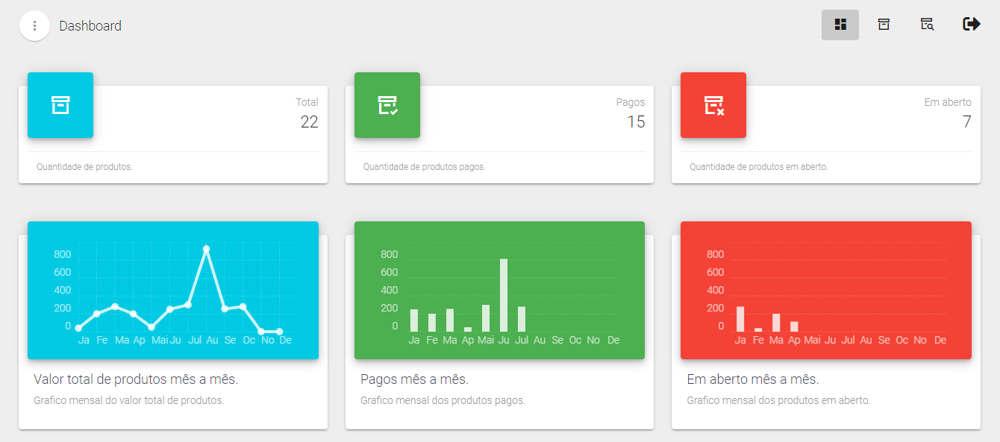
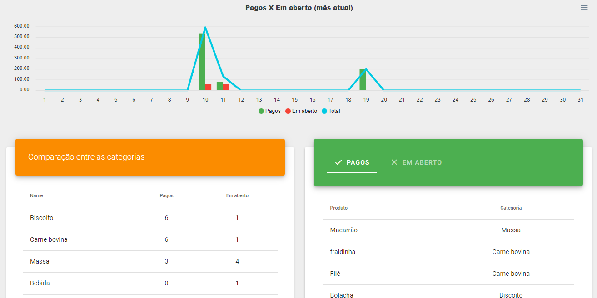
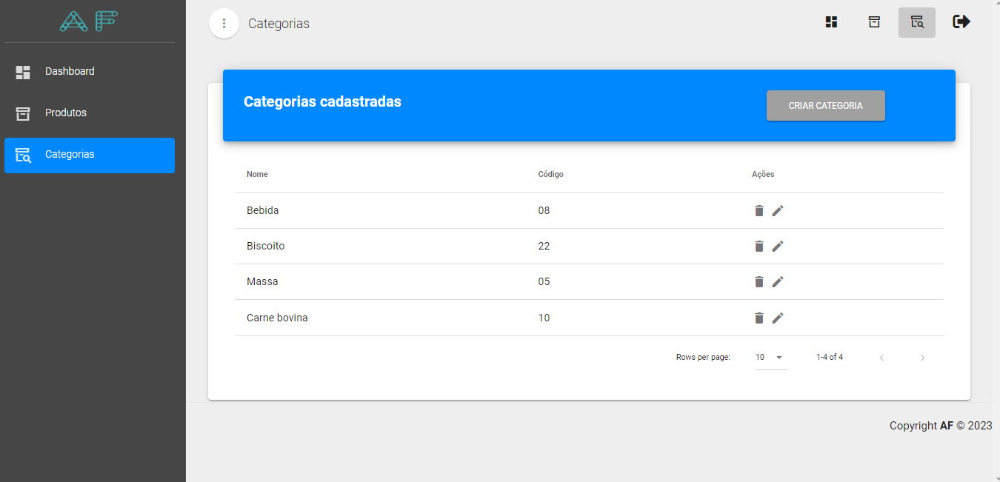

#   

# 📦 AF product:

Projeto desenvolvido para praticar as habilidades com Node.js, Vue.js e MongoDB.

## 🎯Projeto

Este projeto tem como funcionalidades cadastrar,editar,deletar e visualizar os produtos e as categorias e um dashboard com informações importantes a respeito dos produtos e categorias.

###   
###   
###   
###   
###   

## 🧑‍💻 Técnicas e Tecnologias

As técnicas e tecnologias utilizadas no projeto são:

- `Javascript`: Linguagem de programação utilizada no projeto.
- `Node.js`: **Socket** .**IO é** .
- `Vue.js`: **Socket** .**IO é** .

## 📲 Executando o projeto

### ✔️ Pré-requisitos

Para conseguir seguir este README e rodar o projeto você pode precisar dos seguintes itens:

- Git para clonar o projeto e acessar as branches. Você pode instalar [aqui](https://git-scm.com/downloads);
- Node para podermos rodar o `npm`. Você pode instala-lo [aqui](https://nodejs.org/en/);

Se quiser testar as instalações, rodar os comandos abaixo separadamente deve mostrar as respectivas versões.

```
git --version
node --version
npm --version
```

### 🐙 Clonando o projeto

Para ter acesso aos arquivos do projeto você pode clonar usando o seguinte comando:

```
git clone https://github.com/andrefmenezes/AF-Product.git
```

### ▶️ Rodando o Projeto

Agora que já tem a pasta do projeto na sua máquina, dentro das pastas backend e frontend instale as dependências:

```
npm install
```

Preencha as varíaveis de ambiente utilizando o exemplo do arquivo:

> .env.example

E então podemos rodar o projeto:

#### Backend
```
npm run start
```
#### Frontend
```
npm run serve
```

Pronto, agora a aplicação está rodando.
